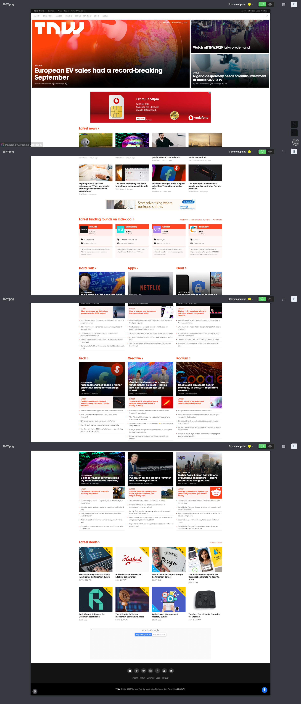
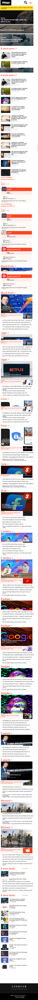
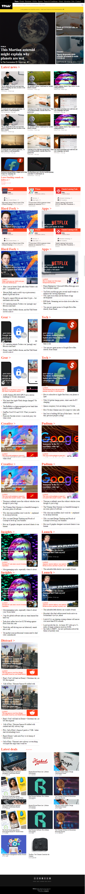

**Project name:**

:The next page Clone**

**Scope**
 
I have clonded a webpage using responsive design.

**Cloned page screeshot** 

**Mobile view** 

**Tablet view** 

**Laptop view** 

**In This project I have:**

Used Media queries to acheive responsive design.

**Built with**
 -   Html
 -    Css

**Live Demo** 
https://erezfree29.github.io/The-next-page-clone/

**Author** 
Erez Friemagor

**Github:** 
@erezfree29

**Twitter:** 
https://twitter.com/friemagor

**Linkedin:** 
https://www.linkedin.com/in/erez-friemagor-3b0bab145/

  

**Contributing? Start by:**

-   Forking the project
-   Cloning the project to your local machine
-   `cd`  into the project directory
-   Run  `git checkout -b your-branch-name`
-   Make your contributions
-   Push your branch up to your forked repository
-   Open a Pull Request with a detailed description to the development branch of the original project for a review